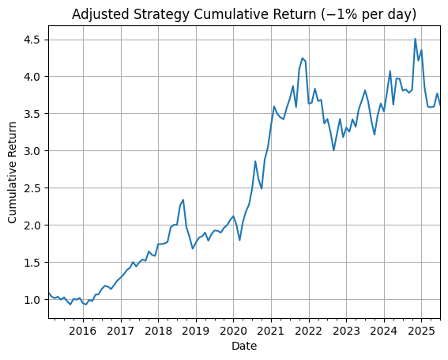

# long-only-momentum-strategy
Python back test of a long-only momentum trading strategy using 3M/6M/12M returns.

# 📈 Momentum Trading Strategy (Long-Only)

This project implements a 'momentum-based long-only strategy' in Python using daily stock data.

→ 🚀 Strategy Highlights  
- Uses '3M', '6M', and '12M momentum' windows  
- Selects 'top 3 performing stocks' daily based on trailing returns  
- 'Equal-weighted', rebalanced daily  
- 'Long-only exposure', no leverage or shorts  

→ 📊 Cumulative Return Plot  

→ 📁 Files  
- `MOMENTUM Trading Strategy.ipynb`: Full strategy notebook  
- `plot.png`: Output chart (optional)  

→ 🛠 How to Run  
1. Open the notebook in Jupyter or Google Colab  
2. Make sure your data (if any) is loaded or simulated  
3. Run all cells to generate performance plot  

→ ✅ Dependencies  
- `pandas`  
- `matplotlib`  
